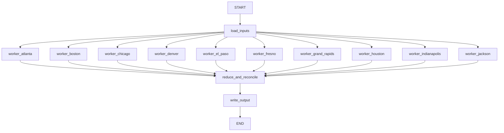

# Retail Reconciliation SwarmBench Task

A self-contained SwarmBench benchmark package designed to evaluate whether multi-agent systems outperform a single agent on a broad, decomposable data-analysis task.

The benchmark asks an agent to reconcile ten inconsistent retail transaction exports into one normalized JSON report. Each store CSV uses different schema conventions and contains edge cases such as refunds, negative quantities, duplicate transaction IDs, and unmapped SKUs. The task is intentionally structured as a map-reduce workflow: independent store-level analysis followed by a final synthesis step that reconciles all totals.

## Highlights

- Designed a deterministic SwarmBench assessment task with role-neutral instructions and a private multi-agent decomposition plan.
- Created ten heterogeneous CSV artifacts plus a product catalog to simulate real-world data integration pressure.
- Implemented an executable verifier with partial scoring across schema normalization, duplicate handling, per-store metrics, category totals, and global totals.
- Added oracle artifacts and validated the package with Harbor: oracle reward `1.0`.
- Added a LangGraph map-reduce solver that demonstrates how multi-agent coordination addresses single-agent coverage and reconciliation failures.
- Packaged the benchmark in the required Harbor/SwarmBench format with Docker runtime configuration.

## Task Structure

```text
retail-reconciliation-swarmbench/
|-- instruction.md
|-- task.toml
|-- decomposition.yaml
|-- gap_strategy.md
|-- environment/
|   |-- Dockerfile
|   `-- input_artifacts/
|-- tests/
|   |-- test.sh
|   |-- verify.py
|   |-- judge.py
|   `-- oracle.json
|-- solution/
|   |-- solve.sh
|   `-- oracle.json
`-- examples/
    `-- langgraph_reconcile.py
```

## Why This Benchmark Creates a Multi-Agent Gap

The task has ten naturally independent input shards, each with its own schema aliases and data-quality traps. A single agent must process every file sequentially while preserving global reconciliation rules, which increases the risk of missed files, inconsistent normalization, incorrect refund handling, or double-counted duplicates.

A multi-agent system can assign each store file to a separate worker, then use a reducer to verify coverage, remove duplicates by the required ordering rule, and produce the final consolidated report.

## LangGraph Multi-Agent Solver

The `examples/langgraph_reconcile.py` file shows how the same benchmark can be solved with a LangGraph map-reduce workflow.



Single-agent failure modes are addressed directly:

| Single-agent issue | LangGraph solution |
| --- | --- |
| Misses one or more CSV files | One worker node owns each store file |
| Confuses schema aliases | Each worker normalizes a small local schema |
| Double-counts duplicate IDs | Reducer performs global duplicate removal |
| Mishandles refunds | Workers classify refunds and negative quantities before synthesis |
| Produces inconsistent totals | Reducer recomputes final store, category, and global totals |

Run the LangGraph example inside a task-like environment with `langgraph` installed:

```bash
python examples/langgraph_reconcile.py
bash /tests/test.sh
```

## Validation

Official Harbor oracle validation completed successfully:

```text
Trials: 1
Exceptions: 0
Mean reward: 1.000
Reward: 1.0
```

## Resume Summary

Built a Dockerized SwarmBench benchmark for evaluating multi-agent AI coordination on a realistic retail data reconciliation task. Designed heterogeneous CSV artifacts, map-reduce decomposition, deterministic partial-credit verifier, LangGraph solver, and oracle solution; validated with Harbor at reward `1.0`.
