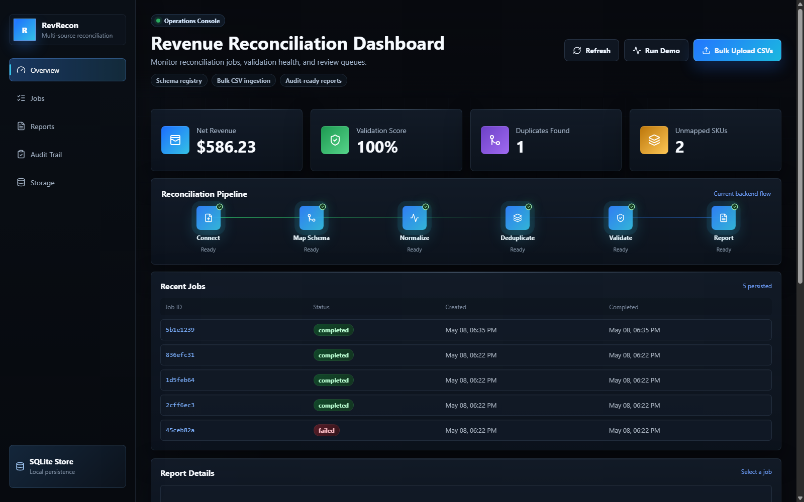
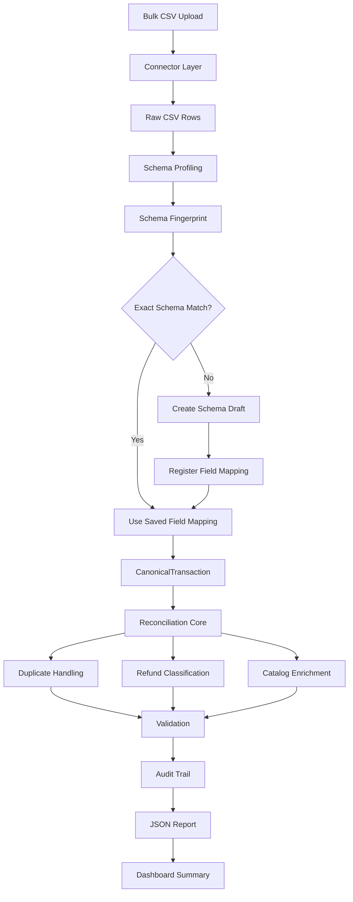

# RevRecon: Revenue Reconciliation Platform

RevRecon is a full-stack revenue reconciliation platform I built to solve a practical data problem: retail transaction exports rarely arrive in one clean format.

Different stores and tools can send CSV files with different headers, duplicate transaction IDs, refunds, negative quantities, missing catalog mappings, and totals that are hard to trust. This project takes those messy files and turns them into one normalized, auditable reconciliation report.



## What I Built

RevRecon currently includes:

- FastAPI backend for reconciliation jobs and reports.
- React + TypeScript dashboard for reviewing results.
- Bulk CSV upload from the UI.
- Schema profiling for uploaded CSV files.
- Schema fingerprinting to recognize repeat file formats.
- Schema registry with field-mapping validation.
- Canonical transaction models using Pydantic.
- Deterministic reconciliation logic for sales, refunds, duplicates, SKUs, and totals.
- SQLite job persistence through SQLAlchemy.
- JSON report artifacts for completed jobs.
- Tests that protect API behavior, schema onboarding, and mapped reconciliation.
- A packaged SwarmBench benchmark task for retail reconciliation.

## Why This Project Matters

In real businesses, transaction data does not always come from one clean system.

One company may send:

```text
transaction_id,date,sku,quantity,unit_price
```

Another company may send:

```text
Order No,Txn Date,Product Code,Qty Sold,Price
```

The important part is not forcing every company to rename their columns. The important part is learning how that company's schema maps into my internal canonical model.

That is the core idea behind this project:

```text
Any client CSV
-> schema profile
-> schema fingerprint
-> saved field mapping
-> canonical transaction
-> reconciliation report
```

## Current Flow



## Dashboard

The dashboard is built for operational review. I can:

- Run a demo reconciliation job.
- Upload multiple CSV files in one action.
- See net revenue, validation score, duplicates, and unmapped SKU count.
- Review recent jobs and job status.
- Open report details for completed jobs.
- Inspect source-level totals.
- Review category revenue.
- Check duplicate and unmapped SKU signals.
- Open raw JSON reports when needed.

## Backend API

| Method | Endpoint | Purpose |
| --- | --- | --- |
| `GET` | `/health` | Health check |
| `POST` | `/jobs/demo` | Create and run a demo reconciliation job |
| `POST` | `/jobs/run-demo` | Generate the latest demo report |
| `POST` | `/jobs/upload-csv` | Upload one or more CSV files |
| `GET` | `/jobs` | List persisted jobs |
| `GET` | `/jobs/{job_id}` | Get one job |
| `GET` | `/jobs/{job_id}/report` | Get a completed job report |
| `GET` | `/dashboard/summary` | Get dashboard metrics and review data |
| `GET` | `/reports/latest` | Get latest report artifact |
| `POST` | `/schema/profile-csv` | Profile CSV headers and resolve schema match |
| `POST` | `/schema/register` | Register a schema mapping from a CSV profile |

## Repository Structure

```text
multi-agent-reconciliation-platform/
|-- backend/
|   |-- app/
|   |   |-- main.py
|   |   |-- api/
|   |   |-- connectors/
|   |   |   |-- base.py
|   |   |   |-- csv_connector.py
|   |   |   |-- excelConnector.py
|   |   |   |-- apiConnector.py
|   |   |   |-- postgresConnector.py
|   |   |   `-- s3Connector.py
|   |   |-- core/
|   |   |   |-- canonical_fields.py
|   |   |   |-- catalog.py
|   |   |   |-- config.py
|   |   |   |-- csv_profiler.py
|   |   |   |-- dashboard.py
|   |   |   |-- database.py
|   |   |   |-- db_models.py
|   |   |   |-- job_store.py
|   |   |   |-- models.py
|   |   |   |-- reconciliation.py
|   |   |   |-- report_writer.py
|   |   |   |-- schema_fingerprint.py
|   |   |   |-- schema_mapping.py
|   |   |   |-- schema_registry.py
|   |   |   `-- validation.py
|   |   `-- services/
|   `-- tests/
|       `-- test_api.py
|-- docs/
|   `-- assets/
|       `-- dashboard.png
|-- examples/
|   `-- langgraph_reconcile.py
|-- frontend/
|   |-- index.html
|   |-- package.json
|   |-- vite.config.ts
|   |-- tsconfig.json
|   `-- src/
|       |-- App.tsx
|       |-- api.ts
|       |-- main.tsx
|       |-- styles.css
|       |-- types.ts
|       `-- vite-env.d.ts
|-- sample_data/
|   |-- finance/
|   |-- healthcare/
|   `-- retail/
|       |-- atlanta.csv
|       |-- boston.csv
|       |-- chicago.csv
|       |-- denver.csv
|       |-- el_paso.csv
|       |-- fresno.csv
|       |-- grand_rapids.csv
|       |-- houston.csv
|       |-- indianapolis.csv
|       |-- jackson.csv
|       `-- product_catalog.csv
|-- retail-reconciliation-swarmbench/
|-- requirements.txt
`-- README.md
```

## Backend Setup

From the project root:

```powershell
python -m venv .venv
.\.venv\Scripts\Activate.ps1
python -m pip install -r requirements.txt
```

Start the backend:

```powershell
.\.venv\Scripts\python.exe -m uvicorn backend.app.main:app --host 127.0.0.1 --port 8000
```

Open the API docs:

```text
http://127.0.0.1:8000/docs
```

## Frontend Setup

In another terminal:

```powershell
cd frontend
npm install
npm run dev
```

Open:

```text
http://127.0.0.1:5173
```

The frontend calls the backend through Vite's `/api` proxy.

## How I Test It

Run backend tests:

```powershell
.\.venv\Scripts\python.exe -m pytest backend\tests
```

Expected result:

```text
13 passed
```

Build the frontend:

```powershell
cd frontend
npm run build
```

## Main Reconciliation Rules

The backend follows explicit rules:

- Refunds are detected from negative quantity or refund-like transaction type.
- Amount is calculated from absolute quantity times unit price.
- Money is handled with Decimal precision.
- Source reports are calculated per file.
- Duplicate transaction IDs are skipped globally after the first accepted transaction.
- Product catalog enrichment adds categories.
- Unknown SKUs are flagged for review.
- Audit events are generated for duplicate skips and unmapped SKUs.
- Final reports are validated before being shown in the dashboard.

## Schema Registry Logic

The schema registry is one of the most important parts of the project.

When a CSV is uploaded for profiling:

```text
headers -> normalized headers -> ordered fingerprint -> unordered fingerprint
```

If the unordered fingerprint already exists, the system treats it as an exact schema match.

If it does not exist, the CSV becomes a new schema draft. A field mapping can then be registered:

```json
{
  "transaction_id": "Order No",
  "transaction_date": "Txn Date",
  "sku": "Product Code",
  "quantity": "Qty Sold",
  "unit_price": "Price"
}
```

After that, files with the same schema can be reconciled through the saved mapping.

## SwarmBench Benchmark

This repository also includes a self-contained benchmark package:

```text
retail-reconciliation-swarmbench/
```

It includes heterogeneous retail CSV files, a product catalog, oracle artifacts, verifier scripts, a scoring setup, Docker runtime configuration, and a LangGraph map-reduce example for the same reconciliation domain.

## Tech Stack

- Python
- FastAPI
- Pydantic
- SQLAlchemy
- SQLite
- React
- TypeScript
- Vite
- Lucide React
- Pytest

## What I Focused On

I focused on making the project understandable, testable, and close to a real product:

- Clean backend core modules.
- Thin API routes.
- Typed canonical models.
- Reusable connector pattern.
- Deterministic financial calculations.
- Schema onboarding instead of hardcoded headers.
- Bulk CSV upload from the UI.
- Dashboard-first review experience.
- Tests for the important flows.
