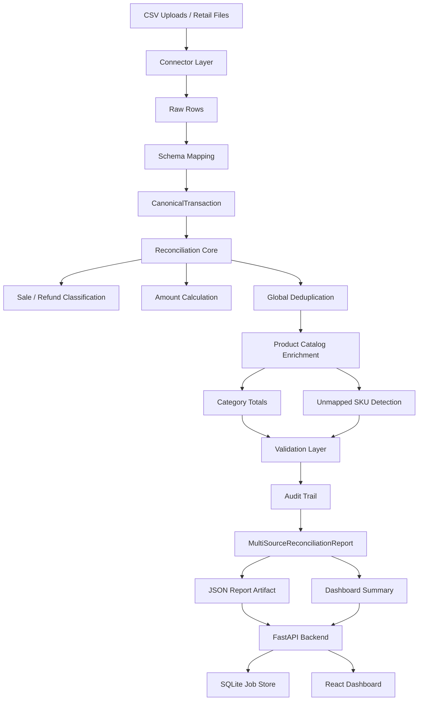

# RevRecon: Revenue Reconciliation Platform

RevRecon is a full-stack reconciliation platform that turns inconsistent retail transaction exports into trusted, auditable revenue reports.

It combines a FastAPI backend, deterministic reconciliation logic, SQLite job persistence, a React dashboard, and a packaged SwarmBench benchmark for evaluating decomposition-heavy reconciliation workflows.


## Product Overview

Retail and finance teams often receive transaction files from different stores, tools, and operational systems. Those files can use different column names, contain refunds in multiple formats, include duplicate transaction IDs, reference unknown SKUs, and produce totals that are hard to trust.

RevRecon addresses that problem with a clear reconciliation pipeline:

```text
CSV sources
-> connector ingestion
-> schema mapping
-> canonical transaction models
-> source-level reconciliation
-> global duplicate handling
-> catalog enrichment
-> validation
-> audit trail
-> persisted reports
-> dashboard review
```

The financial calculation layer is deterministic and testable. Every important decision, including duplicate skips and unmapped SKUs, is represented in the generated report and surfaced in the dashboard.

## What The Platform Does

- Upload and reconcile one or more CSV transaction files.
- Normalize heterogeneous CSV headers into canonical transaction fields.
- Classify sales and refunds, including negative-quantity refunds.
- Calculate gross sales, refunds, net revenue, and transaction counts with Decimal precision.
- Remove duplicate transaction IDs globally across uploaded sources.
- Enrich transactions with product catalog categories.
- Detect unmapped SKUs and create review items.
- Generate category revenue summaries.
- Validate report consistency before presenting results.
- Persist reconciliation jobs in SQLite.
- Save completed JSON report artifacts.
- Expose job, report, upload, and dashboard APIs through FastAPI.
- Present metrics, jobs, review queues, category revenue, audit events, and report details in a React dashboard.

## Architecture



## Dashboard

The dashboard is designed around operational review:

- Revenue, validation, duplicate, and unmapped SKU metrics.
- Pipeline visibility from source connection through final report.
- Recent persisted jobs with status and timestamps.
- Clickable completed jobs that open report details.
- Source-level report table.
- Category revenue breakdown.
- Duplicate and unmapped SKU review signals.
- Selected-job audit trail.
- Direct JSON report access for technical inspection.

## Backend API

| Method | Endpoint | Purpose |
| --- | --- | --- |
| `GET` | `/health` | Service health check |
| `POST` | `/jobs/demo` | Run a demo reconciliation job |
| `POST` | `/jobs/run-demo` | Generate the latest demo report |
| `POST` | `/jobs/upload-csv` | Upload one or more CSV files for reconciliation |
| `GET` | `/jobs` | List persisted jobs |
| `GET` | `/jobs/{job_id}` | Fetch job metadata |
| `GET` | `/jobs/{job_id}/report` | Fetch a completed job report |
| `GET` | `/dashboard/summary` | Fetch dashboard-ready metrics and review data |
| `GET` | `/reports/latest` | Fetch the latest generated report artifact |

## Repository Structure

```text
multi-agent-reconciliation-platform/
|-- backend/
|   |-- app/
|   |   |-- main.py
|   |   |-- api/
|   |   |   `-- main.py
|   |   |-- connectors/
|   |   |   |-- base.py
|   |   |   |-- csv_connector.py
|   |   |   |-- excelConnector.py
|   |   |   |-- apiConnector.py
|   |   |   |-- postgresConnector.py
|   |   |   `-- s3Connector.py
|   |   |-- core/
|   |   |   |-- catalog.py
|   |   |   |-- dashboard.py
|   |   |   |-- job_store.py
|   |   |   |-- models.py
|   |   |   |-- reconciliation.py
|   |   |   |-- report_writer.py
|   |   |   |-- schema_mapping.py
|   |   |   `-- validation.py
|   |   `-- services/
|   `-- tests/
|       `-- test_api.py
|-- docs/
|   `-- assets/
|       `-- dashboard.png
|-- examples/
|   `-- langgraph_reconcile.py
|-- frontend/
|   |-- index.html
|   |-- package.json
|   |-- vite.config.ts
|   |-- tsconfig.json
|   `-- src/
|       |-- App.tsx
|       |-- api.ts
|       |-- main.tsx
|       |-- styles.css
|       |-- types.ts
|       `-- vite-env.d.ts
|-- sample_data/
|   `-- retail/
|       |-- atlanta.csv
|       |-- boston.csv
|       |-- chicago.csv
|       |-- denver.csv
|       |-- el_paso.csv
|       |-- fresno.csv
|       |-- grand_rapids.csv
|       |-- houston.csv
|       |-- indianapolis.csv
|       `-- product_catalog.csv
|-- retail-reconciliation-swarmbench/
|-- requirements.txt
`-- README.md
```

Runtime artifacts are ignored by git:

```text
data/reconciliation.db
outputs/reports/*.json
uploads/*
frontend/dist/
frontend/node_modules/
```

## Backend Setup

Create and activate a virtual environment:

```powershell
python -m venv .venv
.\.venv\Scripts\Activate.ps1
```

Install Python dependencies:

```powershell
python -m pip install -r requirements.txt
```

Start the FastAPI backend:

```powershell
python -m uvicorn backend.app.main:app --reload --reload-dir backend --reload-dir sample_data
```

Open API docs:

```text
http://127.0.0.1:8000/docs
```

## Frontend Setup

Install frontend dependencies:

```powershell
cd frontend
npm install
```

Start the React dashboard:

```powershell
npm run dev
```

Open:

```text
http://127.0.0.1:5173
```

The Vite dev server proxies `/api/*` requests to the FastAPI backend.

## Testing

Run backend tests:

```powershell
.\.venv\Scripts\python.exe -m pytest backend\tests
```

Expected result:

```text
6 passed
```

Build the frontend:

```powershell
cd frontend
npm run build
```

## Core Domain Models

The backend uses Pydantic models to keep messy external data separate from trusted internal records.

Key models:

- `CanonicalTransaction`
- `ReconciliationReport`
- `MultiSourceReconciliationReport`
- `CategorySummary`
- `AuditEvent`
- `ValidationResult`
- `ReconciliationJob`

This structure keeps ingestion, normalization, reconciliation, validation, and reporting cleanly separated.

## Reconciliation Rules

RevRecon applies explicit rules that are easy to inspect and test:

- A transaction is a refund when its quantity is negative or its transaction type matches refund terminology.
- Transaction amounts are calculated from absolute quantity and unit price.
- Money values are rounded to two decimal places using Decimal arithmetic.
- Duplicate transaction IDs are skipped after the first accepted occurrence.
- Source-level reports are calculated before global duplicate removal.
- Global totals are calculated after duplicate removal.
- SKUs missing from the product catalog are classified as `unknown`.
- Duplicate and unmapped SKU decisions are written to the audit trail.

## SwarmBench Package

The repository includes a self-contained benchmark package:

```text
retail-reconciliation-swarmbench/
```

It contains heterogeneous retail CSV artifacts, a product catalog, oracle output, verifier scripts, scoring logic, Docker runtime configuration, and a LangGraph map-reduce example. The package demonstrates the same reconciliation domain as a deterministic assessment task.

## Engineering Principles

- Keep financial math deterministic.
- Keep source connectors separate from reconciliation rules.
- Normalize messy inputs into typed canonical models.
- Persist job history and report artifacts.
- Make validation and audit decisions visible.
- Keep API routes thin and business logic inside core modules.
- Use tests to protect reconciliation behavior.
