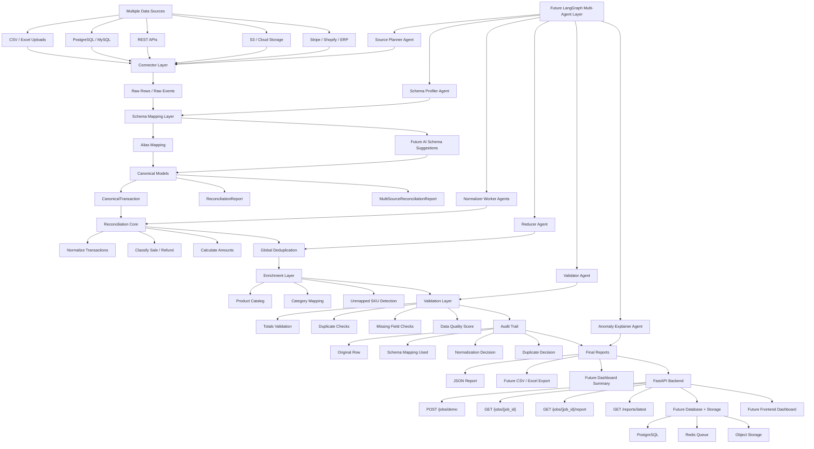

# Multi-Agent Reconciliation Platform

An AI-ready backend platform for reconciling messy business data from multiple sources.

The project ingests heterogeneous retail transaction exports, maps inconsistent schemas into canonical records, removes global duplicates, enriches transactions with product catalog data, validates totals, creates audit events, saves JSON reports, and exposes the workflow through FastAPI.

This is being built as a scalable foundation for future multi-source reconciliation across files, APIs, databases, cloud storage, ecommerce systems, ERPs, and payment platforms.

## Why This Exists

Business data rarely arrives clean.

One team may export CSVs from stores, another may pull data from Shopify, finance may reconcile Stripe or bank payouts, and operations may maintain product catalogs in spreadsheets. Column names differ, duplicates appear, refunds are represented inconsistently, and reference data is often incomplete.

This platform is designed to turn that messy operational data into a trusted reconciliation report with clear validation and auditability.

## Current Status

Implemented:

- CSV connector for retail transaction files
- Schema alias mapping for heterogeneous source columns
- Pydantic canonical transaction and report models
- Single-source reconciliation
- Multi-source reconciliation
- Global duplicate transaction handling
- Product catalog enrichment
- Category-level totals
- Unmapped SKU detection
- Audit events for duplicate and unmapped SKU decisions
- Validation layer for report consistency
- JSON report writer
- FastAPI backend
- In-memory reconciliation job tracking
- Job-specific report lookup
- Included SwarmBench benchmark package and LangGraph example

## Architecture Flow



## Current Runtime Flow

```text
sample_data/retail/*.csv
    -> CsvConnector
    -> schema_mapping.get_value()
    -> CanonicalTransaction
    -> global duplicate removal
    -> product catalog enrichment
    -> category totals
    -> unmapped SKU detection
    -> audit events
    -> validation checks
    -> JSON report
    -> FastAPI response
```

## Project Structure

```text
multi-agent-reconciliation-platform/
|-- backend/
|   |-- app/
|   |   |-- main.py
|   |   |-- api/
|   |   |-- connectors/
|   |   |   |-- base.py
|   |   |   `-- csv_connector.py
|   |   |-- core/
|   |   |   |-- catalog.py
|   |   |   |-- job_store.py
|   |   |   |-- models.py
|   |   |   |-- reconciliation.py
|   |   |   |-- report_writer.py
|   |   |   |-- schema_mapping.py
|   |   |   `-- validation.py
|   |   `-- services/
|   `-- tests/
|-- docs/
|-- frontend/
|-- sample_data/
|   `-- retail/
|       |-- atlanta.csv
|       |-- boston.csv
|       `-- product_catalog.csv
|-- retail-reconciliation-swarmbench/
|-- requirements.txt
`-- README.md
```

## Setup

Create and activate a virtual environment:

```powershell
python -m venv .venv
.\.venv\Scripts\Activate.ps1
```

Install dependencies:

```powershell
pip install -r requirements.txt
```

Run the FastAPI server:

```powershell
python -m uvicorn backend.app.main:app --reload --reload-dir backend --reload-dir sample_data
```

Open the API docs:

```text
http://127.0.0.1:8000/docs
```

## API Endpoints

```text
GET  /health
POST /jobs/run-demo
POST /jobs/demo
GET  /jobs/{job_id}
GET  /jobs/{job_id}/report
GET  /reports/latest
```

Recommended test flow:

1. Run `GET /health`
2. Run `POST /jobs/demo`
3. Copy the returned `job_id`
4. Run `GET /jobs/{job_id}`
5. Run `GET /jobs/{job_id}/report`

Note: jobs are stored in memory for now. If the server restarts, previous job IDs disappear. PostgreSQL persistence is planned.

## Example Output Highlights

The current demo reconciles Atlanta and Boston retail transaction exports.

The generated report includes:

```text
source_count
raw_row_count
transaction_count
gross_sales
refunds
net_revenue
duplicate_transaction_ids
unmapped_skus
audit_events
category_totals
source_reports
```

Example business signals:

```text
duplicate_transaction_ids: ["ATL-003"]
unmapped_skus: ["SKU-7777", "SKU-9999"]
validation.is_valid: true
```

## Core Design Principles

- Connectors fetch data.
- Schema mapping interprets messy source columns.
- Pydantic models define the canonical data shape.
- Reconciliation logic performs deterministic calculations.
- AI may assist with schema suggestions later, but financial math stays deterministic.
- Validation checks whether reports can be trusted.
- Audit events explain important decisions.
- Reports are saved as artifacts that APIs and future dashboards can consume.

## SwarmBench Benchmark

This repository also includes a retail reconciliation SwarmBench benchmark package:

```text
retail-reconciliation-swarmbench/
```

The benchmark contains:

- Ten heterogeneous retail CSV artifacts
- Product catalog data
- Oracle report
- Executable verifier
- Partial scoring logic
- Docker runtime configuration
- LangGraph map-reduce example

The benchmark demonstrates why this problem naturally fits a map-reduce and future multi-agent workflow: each source can be processed independently, while a reducer performs duplicate handling, validation, and final synthesis.

## Roadmap

Near-term:

- Replace in-memory job storage with PostgreSQL
- Add upload endpoints for user-provided CSV files
- Add persistent report and audit metadata
- Add automated tests for reconciliation, validation, and API routes
- Add better error handling for missing columns and invalid source files

Mid-term:

- Add Excel connector
- Add REST API connector
- Add database connector
- Add CSV and Excel report export
- Add frontend dashboard for jobs, reports, validation, and audit events
- Add user-reviewed schema mapping

Long-term:

- Add Redis-backed background workers
- Add LangGraph orchestration
- Add AI schema suggestion and anomaly explanation
- Add source-specific integrations for Stripe, Shopify, QuickBooks, NetSuite, S3, and ERP exports
- Add data quality scoring across sources
- Add multi-tenant SaaS-ready architecture
