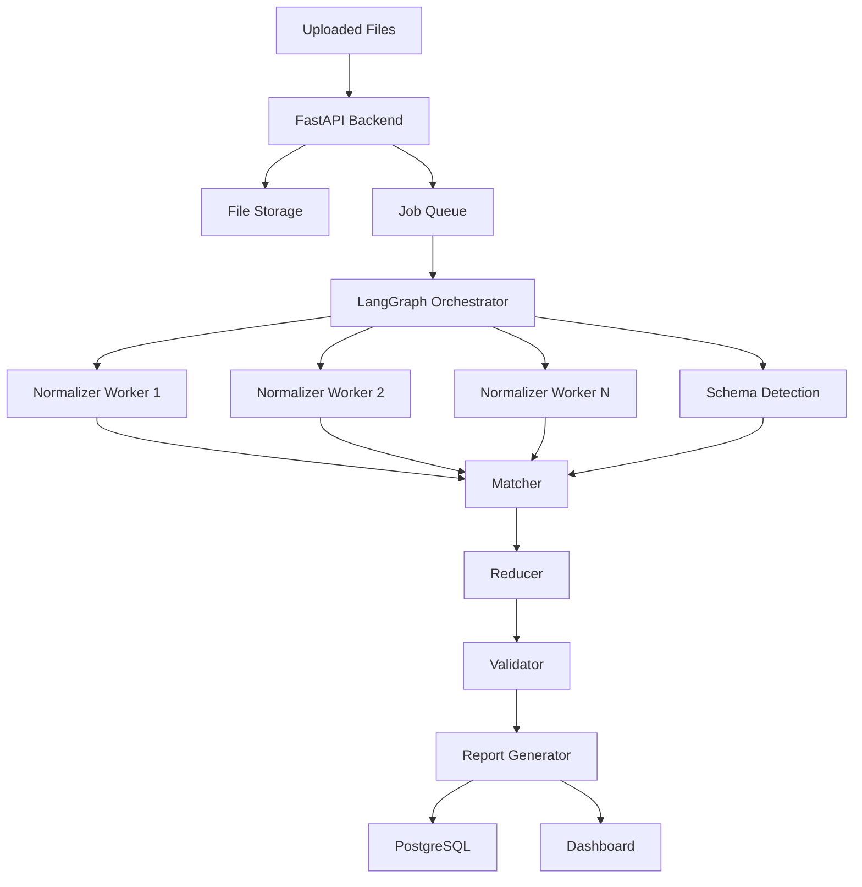

# Architecture

## High-Level Architecture



## First-Principles View

The platform has five core responsibilities:

1. Intake messy files.
2. Convert each row into a canonical record.
3. Match related or duplicate records.
4. Reconcile totals and mismatches.
5. Produce a validated report with an audit trail.

## Start Simple

Your first version should be:

```text
CSV folder -> Python script -> output.json
```

Only add services after the core logic is correct.
